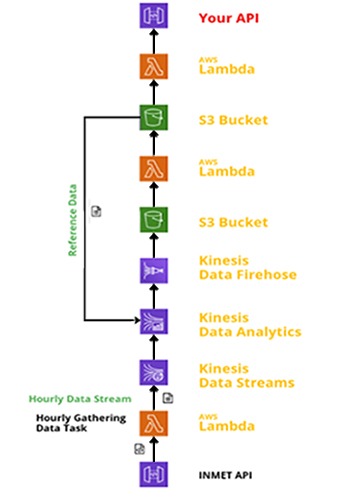

# Projeto Interdisciplinar para Sistemas de Informação IV
### Sistema distribuído em nuvem com AWS Educate junto com API do INMET

O projeto teve o intuito de abordar um sistema em nuvem através de streaming de dados em tempo real através do serviço da Amazon Web Services (AWS). Foi utilizada uma API de dados metodológicos do INMET no estado de Pernambuco como entrada da arquitetura que segue a figura abaixo.

<p align="center">
  
</p>

O problema em questão aborda 7 variáveis metodológicas a qual devem ser intergradas e agregadas em um período de um dia a qual podem ser classificadas como:
  - Acumulado: Soma de todos o valores observados no período de um dia
  - Máximo: O maior valor observado no dia
  - Mínimo: O menor valor observado no dia
  - Média: A média de valor observado no dias


Dentro das variáveis escolhidas, pelo menos uma dessas funções de agregação estão inseridas nelas. Como saída da arquitetura tem uma aplicação que utiliza o resultado do processamento dos dados em uma api própria, dentro dessa api temos endpoints a qual tem dois tipo de saída:
  - Tipo 1
    - Contém as funções de agregação de acumulado e média
    - Retorna o valor no formato json da seguinte forma:
    ```yaml
    { 
      'VALOR_OBSERVADO': '--valor--' 
    }
  - Tipo 2
    - Contêm as funções de agregação de máximo e mínimo
    - Retorna o valor no formato de json na seguinte forma:
    ```yaml 
    { 
      'CODIGO_ESTACAO': '<codigo>', 
      'NOME_ESTACAO': '<nome>',
      'LATITUDE': '<latitude>', 
      'LONGITUDE': '<logitude>',
      'HORARIO_COLETA': '<horario>',
      'VALOR_OBSERVADO': '<valor>' 
    }

  O código para essa API está no diretório de ./api-consumer, com todos os endpoint escolhidos foram:

  ```http
  GET /tempmax
  GET /tempmin
  GET /tempmed
  GET /umidmax
  GET /umidmin
  GET /umidmed
  GET /precipitacao
  ```

## Serviços
  Seguindo a imagem da arquitetura, temos a primeira função lambda a qual faz requisição à API do INMET. Os dados são capturados através do endpoint de hora em hora e os dados são filtrado para o estado de pernambuco com os campos utilizados para o projeto. Logo após os dados são mandado para o Kinesis data Streams. É importante levar em conta que essa função lambda tem um trigger para uma API Gateway que é chamada a cada 20 minutos pela plataforma EasyCron para que os dados estejam sempre atualizado. 
  Este código está disponível em './lambda-functions/producer/'.


  Logo após o Kinesis data Streams capturar os dados enviado, ele se compromete a enviar os dados para algum local e esse é o Kinesis Data Analytics a qual pega os valores do Data Streams e os coloca como entrada para o processamento. Dentro do Analytics os dados são processados por comando SQL de acordo com a sintaxe desenvolvida para stream de dados. Para mais informação sobre SQL do Analytics [clique aqui](https://docs.aws.amazon.com/kinesisanalytics/latest/dev/how-it-works.html). Após os dados serem processados pelo Analytics os dados passam para o Kinesis Data Firehose que encaminha o resultado em um bucket S3. O comando SQL está disponível em './kinesis-analytics'.

  Pelo o Kinesis Data Firehose não ter muita flexibilidade em direcionar os arquivos dos resultados foi utilizado, uma função Lambda com um trigger para o bucket do Firehose foi utilizada. Então a cada momento que um dado é adicionado a função lambda é acionada e repassa esses dados para ser reorganizados dentro de um outro bucket S3 de maneira apropriada para entregar a API final. O código dessa função está em './lambda-functions/consumer'.

  Afinal de tudo temos uma função lambda que retorna os valores do bucket processados através de um link gerado pelo API GATEWAY. Ao acessar a API os resultados vão seguir essa estrutura:
 
  ```yaml
  { 
    'TIPO_DADO': '<tipo-dado>',
    'CODIGO_ESTACAO': '<codigo>', 
    'NOME_ESTACAO': '<nome>',
    'LATITUDE': '<latitude>', 
    'LONGITUDE': '<logitude>',
    'HORARIO': '<horario>',
    'VALUE_CAPTURED': '<valor>'
  }
  ```
  O código para esta última função lambda está disponível em './lambda-functions/distributor'

  ## Referência
  [SQL do Kinesis Data Analytics](https://docs.aws.amazon.com/kinesisanalytics/latest/sqlref/analytics-sql-reference.html)

  [Documentação do AWS Lambda](https://docs.aws.amazon.com/pt_br/lambda/latest/dg/welcome.html)

  [Documentação Kinesis](https://docs.aws.amazon.com/kinesis/?id=docs_gateway)
  
  [SDK Kinesis](https://docs.aws.amazon.com/AWSJavaScriptSDK/latest/AWS/Kinesis.html)

  [SDK S3](https://docs.aws.amazon.com/AWSJavaScriptSDK/latest/AWS/S3.html)


  


  
